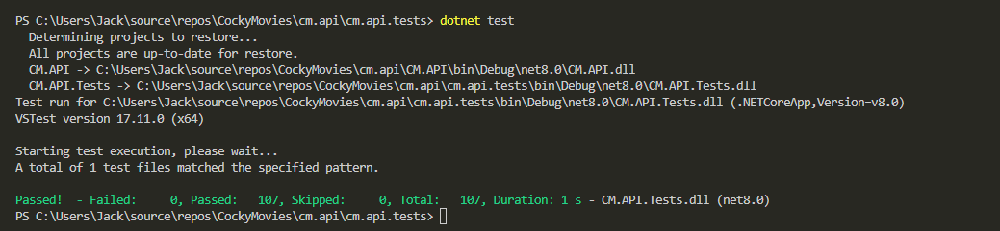

# API Overview
## Tech Stack
- xUnit is used for testing
- EFCore is our O/RM
- We are using MySQL for the database.
- Docker is used to containerize our database to maintain a consistent development environment.

### JWT Secret
- We used JWT tokens for user authentication and authorization.  
`"Key": "YourNewSecretKeyThatIsAtLeast32CharactersLong"`

## Controllers
Controllers are wrappers around the Services. They act as the entry point for API endpoints, take an http request, coordinate with services to process calls, and return an http result. For example, lets look at the `MoviesController` class.  
    
    [ApiController]
    [Route("api/[controller]")]
    public class MoviesController : ControllerBase
    {
        ...

        [HttpDelete("{id}")]
        public async Task<IActionResult> RemoveMovie(int id)
        {
            // First fetch the movie by id
            var movie = await _movieService.GetMovieById(id);
            if (movie == null)
            {
                return NotFound("Movie not found.");
            }
            // Delete the movie
            var success = await _movieService.RemoveMovie(movie);
            if (!success)
            {
                return BadRequest("Failed to remove the movie.");
            }

            return Ok("Movie removed successfully.");
        }
    }

ASP.NET knows `MoviesController` is responsible for handling all requests starting with the path `api/movies` because of the attribute `[Route("api/[controller]")]`. The `[controller]` token is replaced by the name of the controller class, without the "Controller" suffix. The class name is `MoviesController`, so `[controller]` is replaced with "movies". In addition, the RemoveMovie function has the attribute `[HttpDelete("{id}")]`. This means that it handles all `DELETE` requests at `api/movies/{id}`. 

## Services
Services interact with the database directly and use LINQ queries to sort, remove, update, and insert data into the database.

## Interfaces 
Interfaces define contracts for services. They ensure that services adhere to specific methods and behaviors.

## Models
Models represent the data structure of the application. They map to database entities and are used to interact with the database.

## DTOs (Data Transfer Objects)
DTOs are used to transfer data between layers of the application. They are used to shape the data returned by the API or to accept data from API requests.

For example the `MovieCreateDto`

    public class MovieCreateDto
    {

        public int Id { get; set; }
    
        public string? Title { get; set; }
    
        public string? Description { get; set; }
    
        public DateTime DateReleased { get; set; }
    
        public List<int>? GenreIds { get; set; }
    
        public string? ImageUrl { get; set; }
    
        public int RatingId { get; set; }
    }
This DTO is used for creating new movies. It contains key properties for creating a new movie. To process the creation, you need to map the DTO to the movie object. Do this before calling the service method to add the movie to the database.  
Here is an example:

    public async Task<IActionResult> AddMovie([FromBody] MovieCreateDto movieDto)
        {
            ...

            // Map MovieCreateDto to Movie entity and related genres
            var movie = new Movie
            {
                Title = movieDto?.Title ?? string.Empty,
                Description = movieDto?.Description ?? string.Empty,
                DateReleased = movieDto?.DateReleased ?? default,
                // assign the genres to the movie
                Genres = genres,
                // initialize Showtimes
                Showtimes = new List<Showtime>(),
                ImageUrl = movieDto?.ImageUrl ?? string.Empty,
                RatingId = movieDto?.RatingId ?? default
            };

            var success = await _movieService.AddMovie(movie);

            if (!success)
            {
                return BadRequest("A movie with the same ID already exists.");
            }

            return Ok("Movie added successfully.");
        }

## Database Context
The `Data` folder contains the database context and configurations.
`AppDbContext` represents the database context for the app. It includes the DbSet properties for each entity and configures the model using the OnModelCreating method. This is what adds the entities to the database. 

### Data Seeding
The `ModelBuilderExtensions` file in the `Data` folder contains extension methods for the ModelBuilder class, specifically for seeding the database with initial data. 

### Migrations
Each migration file represents a set of changes to the database schema. They include methods for applying and reverting changes.

## Program File
The `Program` file is the entry point for the application. It configures services, middleware, and the HTTP request pipeline.

**Configuration Files** 
- appsettings.json: Contains configuration settings for the application. 
- appsettings.Development.json: Contains configuration settings for the development - - environment. 
- docker-compose.yml: Defines services, networks, and volumes for Docker Compose. 
- dockerfile: Contains instructions for building a Docker image for the application.

## Testing
 - Run backend tests by going to the `cm.api/cm.api.tests` directory
 - Run tests with `dotnet test` 
 - These tests are service and controller unit tests.
 - Here is an image of the results of our tests 
 